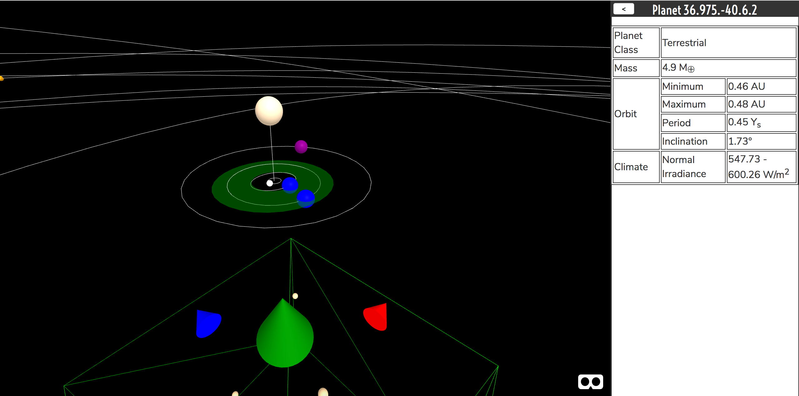

# Macroverse Explorer



This is the next-generation Macroverse Explorer, for browsing stars and planetary systems.

## Installation

```
git clone https://github.com/NovakDistributed/macroverse-explorer.git
cd macroverse-explorer
npm install --dev
```

## Running

```
npm run dev
```

This will run a server on http://localhost:9966. Navigate there in a web3-enabled browser pointing at the Rinkeby testnet, where the Macroverse contracts have already been deployed.

Once you open the web page, your web3 provider will ask you to unlock your account and authorize the dapp. Then you will be walked through minting yourself some test MRV tokens to use in the dapp on the testnet.

## Developing

To run your own testnet for development, make sure you have Truffle installed.

Run `truffle develop` in one terminal, and `migrate --reset` inside that. This will start up a test Ethereum node at `http://localhost:9545`.

Run `npm run dev` in another terminal, to run `budo`, which will serve the frontend on `http://localhost:9966`.

Make sure your MetaMask or other Ethereum provider in your browser is set to talk to `http://localhost:9545`, and then open the frontend.

You will have to edit `create_provider()` in `app/eth.js` if you want to use a provider other than your browser's built-in one (i.e. make the dapp talk directly to Truffle, without MetaMask).

## Troubleshooting

Sometimes, the Truffle contract files can get messed up, since we are pulling in built JSONs and we have no source. You can try running `node scripts/install.js` if you think that this may have happened to you.

### Deploying

To deploy the Macroverse Explorer in production:

```
npm install

npm run build

git commit
            
npm run deploy
```
